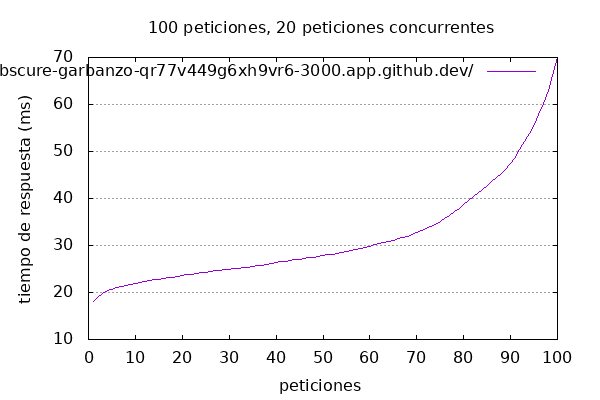

# Resultados de la prueba de carga con Apache Benchmark

## URL probada: https://obscure-garbanzo-qr77v449g6xh9vr6-3000.app.github.dev/

- **Número de peticiones**: 100
- **Peticiones concurrentes**: 20

### Resultados de la prueba

```
This is ApacheBench, Version 2.3 <$Revision: 1843412 $>
Copyright 1996 Adam Twiss, Zeus Technology Ltd, http://www.zeustech.net/
Licensed to The Apache Software Foundation, http://www.apache.org/

Benchmarking obscure-garbanzo-qr77v449g6xh9vr6-3000.app.github.dev (be patient).....done


Server Software:        
Server Hostname:        obscure-garbanzo-qr77v449g6xh9vr6-3000.app.github.dev
Server Port:            443
SSL/TLS Protocol:       TLSv1.2,ECDHE-RSA-AES256-GCM-SHA384,2048,256
Server Temp Key:        X25519 253 bits
TLS Server Name:        obscure-garbanzo-qr77v449g6xh9vr6-3000.app.github.dev

Document Path:          /
Document Length:        0 bytes

Concurrency Level:      20
Time taken for tests:   0.208 seconds
Complete requests:      100
Failed requests:        0
Non-2xx responses:      100
Total transferred:      67600 bytes
HTML transferred:       0 bytes
Requests per second:    480.69 [#/sec] (mean)
Time per request:       41.607 [ms] (mean)
Time per request:       2.080 [ms] (mean, across all concurrent requests)
Transfer rate:          317.33 [Kbytes/sec] received

Connection Times (ms)
              min  mean[+/-sd] median   max
Connect:        6   11   5.6      9      35
Processing:    11   21   7.8     18      49
Waiting:       11   21   7.8     18      49
Total:         18   32  10.9     28      70

Percentage of the requests served within a certain time (ms)
  50%     28
  66%     31
  75%     35
  80%     40
  90%     46
  95%     56
  98%     66
  99%     70
 100%     70 (longest request)
```

### Gráfico de tiempos de respuesta



Este gráfico muestra el tiempo de respuesta (ms) de las 100 peticiones realizadas de manera concurrente con 20 peticiones en paralelo.
