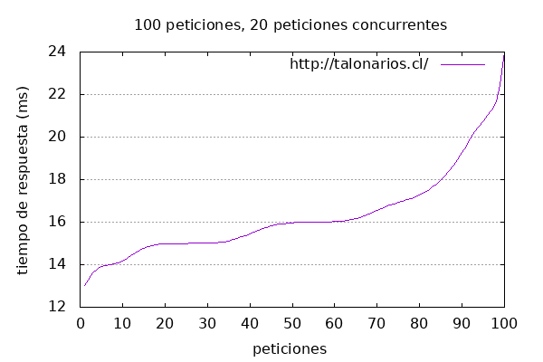

# Resultados de la prueba de carga con Apache Benchmark

## URL probada: https://talonarios.cl/

- **Número de peticiones**: 100
- **Peticiones concurrentes**: 20

### Resultados de la prueba

```
This is ApacheBench, Version 2.3 <$Revision: 1843412 $>
Copyright 1996 Adam Twiss, Zeus Technology Ltd, http://www.zeustech.net/
Licensed to The Apache Software Foundation, http://www.apache.org/

Benchmarking talonarios.cl (be patient).....done


Server Software:        Vercel
Server Hostname:        talonarios.cl
Server Port:            443
SSL/TLS Protocol:       TLSv1.2,ECDHE-RSA-AES128-GCM-SHA256,2048,128
Server Temp Key:        X25519 253 bits
TLS Server Name:        talonarios.cl

Document Path:          /
Document Length:        15 bytes

Concurrency Level:      20
Time taken for tests:   0.470 seconds
Complete requests:      100
Failed requests:        0
Non-2xx responses:      100
Total transferred:      35900 bytes
HTML transferred:       1500 bytes
Requests per second:    212.67 [#/sec] (mean)
Time per request:       94.041 [ms] (mean)
Time per request:       4.702 [ms] (mean, across all concurrent requests)
Transfer rate:          74.56 [Kbytes/sec] received

Connection Times (ms)
              min  mean[+/-sd] median   max
Connect:       22   25   1.6     24      30
Processing:     8   20  38.0     12     351
Waiting:        8   20  38.0     12     351
Total:         30   45  38.4     37     380

Percentage of the requests served within a certain time (ms)
  50%     37
  66%     40
  75%     41
  80%     45
  90%     51
  95%     68
  98%    181
  99%    380
 100%    380 (longest request)
```

### Gráfico de tiempos de respuesta



Este gráfico muestra el tiempo de respuesta (ms) de las 100 peticiones realizadas de manera concurrente con 20 peticiones en paralelo.
